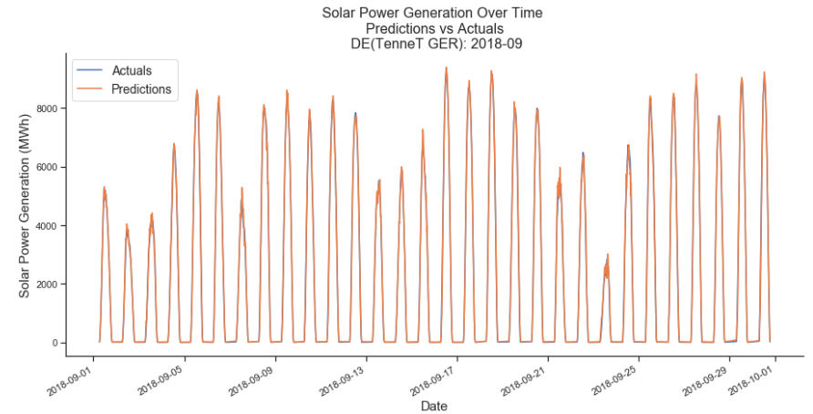
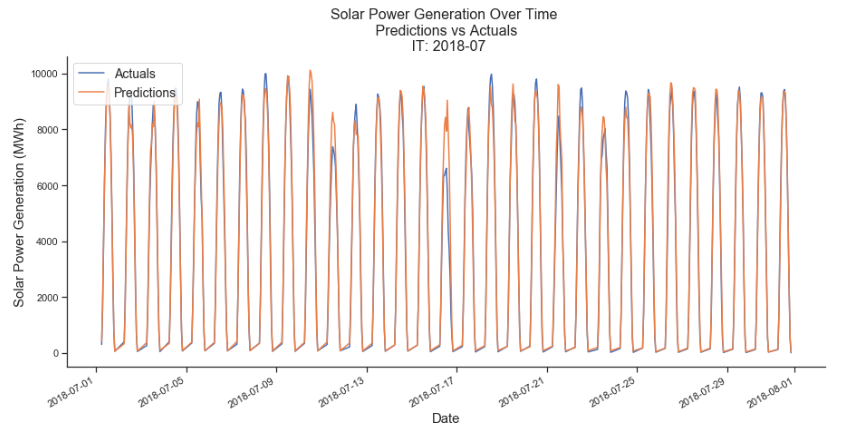

# Predicting Distributed Solar Power Production
### A lightweight approach to predicting solar power generation based on regional weather variations, using tree ensembles and deep learning

## Contents
**[Motivation](#Motivation)** 
**[Methodology](#Methodology)** 
**[Results](#Results)** 
**[Conclusion](#Next-Steps)** 
**[Usage](#Usage)** 

## Motivation
The biggest challenge to greater integration of solar power is its [intermittency](https://www.vox.com/energy-and-environment/2018/3/20/17128478/solar-duck-curve-nrel-researcher) and [unpredictability](https://www.vox.com/2015/6/19/8808545/wind-solar-grid-integration). Grid operators make up for this variability by keeping conventional plants on standby, and [curtailing](https://www.greentechmedia.com/articles/read/an-illustrated-guide-to-solar-curtailment-in-california) renewable generation once it crosses a certain threshold. These inefficiencies [raise generation costs](https://www.vox.com/energy-and-environment/2017/4/7/15159034/100-renewable-energy-studies), [distort price signals](https://mercomindia.com/solar-curtailment-issue-power-developers/), and harm grid stability. Accurate predictions mitigate much of this, allowing for better planning, increased resilience, improved dispatch of conventional sources, and reduced curtailment of renewables.

Solar forecasting however, is in its [infancy](https://www.nrel.gov/docs/fy16osti/65728.pdf), and is only getting harder as generation becomes more [distributed](https://www.vox.com/energy-and-environment/2017/12/15/16714146/greener-more-reliable-more-resilient-grid-microgrids). [Current](https://www.nrel.gov/docs/fy16osti/65728.pdf) [techniques](https://mail.google.com/mail/u/0/#search/evhilton/LXphbRLrghxkrJpTdcKcVSSGCHmMKZkNfzlcqBqWgbB?projector=1&messagePartId=0.1) rely on near real-time smart meter data from small-scale installations, as well as hard to come by details like location, hardware, and panel orientation. Furthermore, much of this localized generation is consumed on-site and is invisible to operators, making net generation forecasting even trickier. As we transition to a cleaner, [decentralized grid](https://www.vox.com/energy-and-environment/2018/11/30/17868620/renewable-energy-power-grid-architecture) with thousands of distributed installations, this approach will struggle to scale.

In contrast, stable, simple, and accurate predictions can be generated by appropriately weighing the impact of regional weather variations on overall solar power production. Machine learning algorithms, excellent at determining the relationship of parts to a whole, are ideally suited to this task. Furthermore, the complex relationship between weather, installed capacity, and equipment efficiency is far more stable on an aggregate level than it is for individual installations. And with only weather forecasts, aggregate capacity, and system-wide power generation as dependencies, these predictions can be produced quickly, with minimal infrastructure and engineering overhead.

## Methodology

### Scope
The purpose of this exercise is to demonstrate the viability of the approach across operators dealing with a variety of meteorological, infrastructural, and regulatory conditions. Given the relatively [high](https://www.power-technology.com/features/mapping-boom-global-solar-power/) degree of solar penetration in Europe, and the [urgent](https://www.nytimes.com/2017/12/25/business/energy-environment/germany-electricity-negative-prices.html) need for smarter, more agile grids, the methodology is tested on operators across Germany, France, Spain, and Italy. 

Instead of optimizing fully for a given grid, which is difficult to do in the absence of geographical generation profiles, satellite imagery, or information on curtailment decisions, the focus is on determining the outer bound of the error, which as we'll see is encouraging enough to warrant bringing in these additional data sources. 

### Timescales
In keeping with industry practice, system-wide predictions are generated at both intra-day and day-ahead timescales. Day ahead forecasts are published the day before delivery, while intra-day forecasts, used to ensure grid stability and market clearing, are consistently updated throughout the day.

### Data
Total installed capacity, weather conditions at a select number of representative coordinates, and historical generation patterns are used to predict aggregate solar power production across a given area of operation. 

Coordinates are broadly selected based on the geographical distribution of solar insolation. The number of points is uniformly set at 5 to demonstrate the accuracy of a streamlined approach, but should be calibrated in production for maximum predictability. Actual weather conditions are used instead of forecasts to isolate the impact of a distributed approach, and to make the methodology independent of the weather forecasting service used. This modularity ensures the easy incorporation of best in class, regionally tailored weather prediction models and satellite imagery. Equipment efficiency, instead of being quantified as an input, is inferred by the models themselves.

### Algorithms
A combination of tree ensembles and neural nets works well here. Trees are able to infer generation from the weather, pick up on seasonal patterns, and appropriately weigh conditions at different coordinates. But they struggle with new situations and long-term trends. Neural nets extrapolate better, and through the use of entity embeddings, capture rich, semantic relatonships between variables. The technique is detailed in [these](https://arxiv.org/abs/1604.06737) [papers](https://arxiv.org/pdf/1508.00021.pdf) and has been successful at similar [tasks](http://blog.kaggle.com/2016/01/22/rossmann-store-sales-winners-interview-3rd-place-cheng-gui/).

### Validation and Testing
The models are validated on May - July 2018, and tested on August - September 2018. This period was chosen for two reasons:

- Generation is higher, more spread out, and harder to integrate in the summer than in winter
- The models need to perform well across both peak (July, August) and transitional, high variability periods (May, June, and September)

## Results
### Intra-day Forecasts
The approach performs quite well for intra-day forecasts, with a Median Absolute Percentage Error ranging from 3-5%. 

| Operator       | RMSE(MWh)| MDAPE(%)|   
| ---------------|---------:|--------:|
| ES             |168.5     |3.85     |
| IT             |278.1     |4.56     |
| FR             |130.1     |4.27     |
| DE(Amprion)    |146.9     |4.22     |
| DE(TenneT GER) |190.8     |3.49     |
| DE(TransnetBW) |89.7      |4.58     |
| DE(50Hertz)    |238.7     |5.52     |

Performance for Tennet in September is shown below.

This is encouraging, showing that a quick, lightweight approach can be quite accurate for near-term forecasting.

### Day-ahead Forecasts

Results for day-ahead forecasts aren't quite as strong, with abrupt peaks and dips proving particularly problematic.

| Operator       | RMSE(MWh)| MDAPE(%)|   
| ---------------|---------:|--------:|
| ES             |484.4     |9.95     |
| IT             |698.0     |8.67     |
| FR             |327.0     |8.82     |
| DE(Amprion)    |431.9     |11.52    |
| DE(TenneT GER) |850.1     |12.88    |
| DE(TransnetBW) |293.1     |12.26    |
| DE(50Hertz)    |827.4     |15.57    |

This is evident for Italy below. 

Better weather data, coordinates better aligned with the actual generation profile, and information on curtailment decisions should help ameliorate this.

Performance can further be improved by building separate models for periods of high and low generation, and perhaps even leveraging them selectively when forecasts say that the weather is going are to be unseasonably bright or gray.

## Conclusion
Using historical generation, annual installed capacity, and the weather at just five broadly distributed coordinates, we're able to predict solar generation to within 3-5% for intra-day forecasts. This is encouraging, given that the purpose of this exercise was to develop a lightweight, accurate approach to near-term forecasting.

The methodology was also tested on day-ahead forecasts. While the error ranges from a largely acceptable 10-12%, the models struggle to predict abrupt peaks and dips. We're not privy to decisions operators make regarding curtailment, or to the actual geographical generation profile. Incorporating these aspects, as well as the sophisticated weather data operators have access to, should boost performance.

Ideally, this technique would be benchmarked against current forecasting methods. Doing this properly however, requires access to the same data operators have access to (weather, curtailment, geographical generation), as well as information on when forecasts are made relative to power generation.  

## Usage
### Environment
- Create environment: `conda env create -f environment.yml`
- The deep learning code is implemented in pytorch. Those new to deep learning can alternatively use the fastai implementation (a wrapper around pytorch that makes things simpler). 
- We'll use an earlier version of fastai that makes it easier to see what's going on behind the scenes -  `pip install fastai==0.7.0` 

### Data
The data folder contains both cleaned, processed data, as well as sample raw
data files

- processed_data
    - actuals.csv: Actual solar power generation by operator
    - capacity.csv: Annual installed capacity by operator
    - int_lengths.yml: Generation reporting intervals by operator

- sample_raw_data
    - IT_Actual_Generation_2017-2018.csv: Actual generation by production type for Italy
    - IT_Installed_Capacity_2016-2019.csv: Installed capacity by production type for Italy
    - wr_2018-11-14_2018-11-15.json: Historical weather data across coordinates pulled from the [Dark Sky API](https://darksky.net/dev)

The coordinates are listed in coordinates.yml.

Weather data is large, and sits behind the Dark Sky API, so it isn't included here. Instructions on extracting it can be found in DataExtractionProcessing.ipynb.

### Extraction, Exploration, and Modeling
The focus is on exposition, so the notebooks below walk through the methodology and results in detail. 

They also point to relevant sections of the codebase as necessary

- DataExtractionProcessing.ipynb
- DataExploration.ipynb
- FeatureEngineering.ipynb
- Modeling.ipynb
